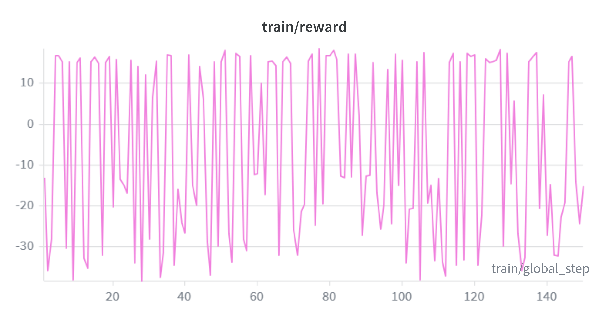
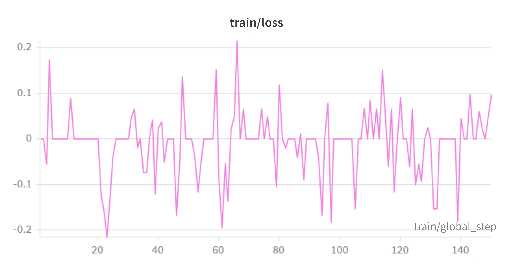

Space Fault Recovery Agent
                            
  The problem
                                                                                        
  When we send probes to deep space, we're bottlenecked by the speed of light. A radio  
  signal to Mars takes around half an hour each way. For time-sensitive failures, that  
  round-trip means hours can pass before engineers on Earth even see a problem, let     
  alone fix it. The further out we go, the worse this gets — communication with a
  Voyager-style probe can take a full day round-trip.

  Deep space exploration will always be capped as long as probes rely on humans to      
  recover from failures. A probe that can diagnose and repair itself opens up missions
  we currently can't attempt.                                                           
                  
  Why RL?

  Most spacecraft today recover from faults using rule-based systems — long lists of "if
   this sensor reads X, do Y" hardcoded by engineers. These work beautifully for
  situations the engineers anticipated. They fall apart when something happens that     
  nobody put on the list.

  JAXA's Hayabusa mission is a good example. A solar flare damaged its solar panels,    
  which cascaded into malfunctioning reaction wheels (the spinning gyros that point the
  probe). The mission was eventually recovered, but only after engineers spent countless
   hours on Earth crafting a stabilization plan that wasn't in the original playbook.

  A reinforcement learning agent doesn't need every scenario hardcoded ahead of time.   
  Instead, it learns from experience how to recognize trouble and recover — including
  from situations its designers never imagined.                                         
                  
  The environment

  We built a simulated spacecraft with 7 classes of faults spanning power, attitude,    
  comms, and thermal systems. Crucially, the systems are interdependent: a power fault
  starves the comms transmitter; a damaged solar panel forces the battery to drain      
  faster; a thermal anomaly can corrupt the star tracker the probe uses to point itself.

  The agent doesn't get a clean readout of what's actually broken. It sees only what its
   sensors report, and sensors themselves can be degraded or lying. To find out the
  truth, the agent has to actively investigate — running one of 17 diagnostic and repair
   commands to query a subsystem, cross-check sensors, shed load, or attempt a repair.
  Every diagnostic costs time, and every wrong repair makes things worse.

  This is what makes the problem genuinely hard: the agent isn't just picking the right 
  action from a clear menu. It has to figure out what's wrong before it can fix it, with
   incomplete and sometimes misleading information.                                     
                  
  What has the agent learnt?

  We trained a small (1.5B-parameter) language model with GRPO — a reinforcement        
  learning method that lets the agent try different repair strategies, score them by how
   well the spacecraft recovers, and gradually shift toward the strategies that work.   
                  
  After 500 training steps on an A100 GPU, the agent's mean reward on a held-out set
  of fault scenarios it had never seen moved from -27.43 before training to -24.09
  after — a +3.35-point improvement, or +12.2%. In a partially-observable, multi-step
  environment with cascading failures, that's the agent meaningfully shifting away
  from "guess wrong, lose the probe" and toward a recovery posture.

  You can see the learning happen in the training curves themselves:

  
  *Reward (rewards/reward_fn/mean) vs. training step. Moving average overlaid to cut through GRPO's noisy per-step signal.*

  
  *Training loss vs. step. Loss values in GRPO are smaller than in supervised learning — what matters is the trend, not the absolute scale.*

  Three things stood out from the training run:

  - **The first action matters more than anything else.** Look at the reward curve:
  every step bounces between roughly +15 and -30. That's not random noise — the
  agent's very first command in a scenario almost entirely decides whether the probe
  ends up recovered or lost. A good opening move lets the rest of the recovery fall
  into place; a bad one triggers a fault cascade nothing downstream can fix.
  - **Training nudged probability away from the catastrophic moves.** That's where
  the +12.2% gain in mean reward comes from. The agent didn't unlock dramatic new
  strategies — it started picking the worst first moves slightly less often than it
  did before. Small shift, real shift.
  - **Full mission recovery is still rare.** Mean reward improved, but the agent
  doesn't yet string together enough good decisions across a full 50-step episode to
  bring the probe all the way home. The needle is moving in the right direction; it
  hasn't crossed the line yet.

  The result we cared about — *can a small model, given only sensor readings and 17
  commands, start to push a damaged spacecraft back toward stability?* — is starting
  to look like yes. Pushing it further is mostly an engineering problem from here:
  more training, denser reward signals, and a longer time budget on the GPU.

  What's next

  This is hackathon-stage work, not a flight-ready system. The next steps are: more     
  training, harder fault scenarios, and eventually testing whether what the agent
  learned in our simulator transfers to real spacecraft simulations like NASA's GMAT.   
                  
  The bigger picture: probes that can fix themselves aren't a far-future fantasy. The   
  pieces — small efficient models, RL training that runs on a single GPU, simulators
  rich enough to teach real strategies — exist today. The interesting question isn't    
  whether this is possible. It's how soon we put it in space.

  I genuinely think that a concept like this can change how we perform deep space exploration. Perhaps, one day, we'll have probes that don't suffer the same fate as, for instance, opportunity on distant lands where communication with humanity takes very long. 
